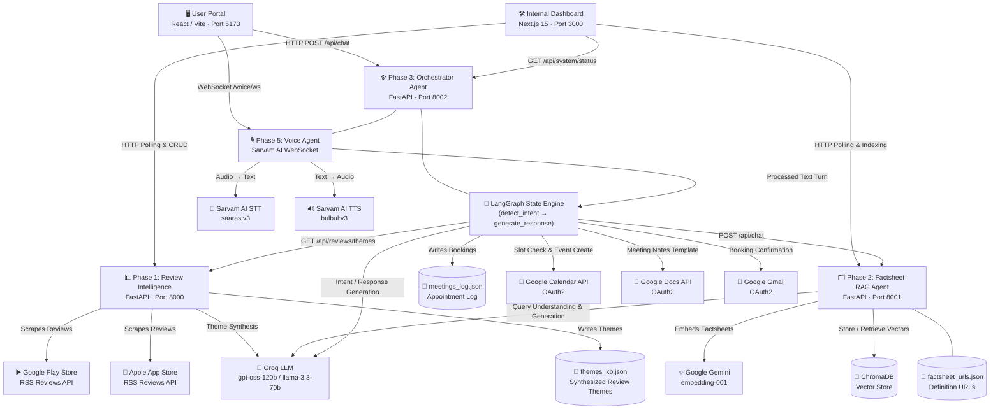
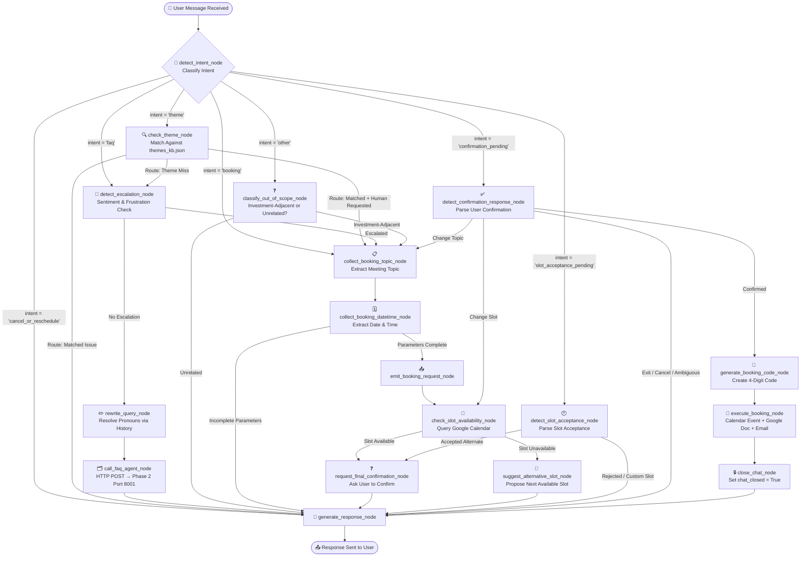
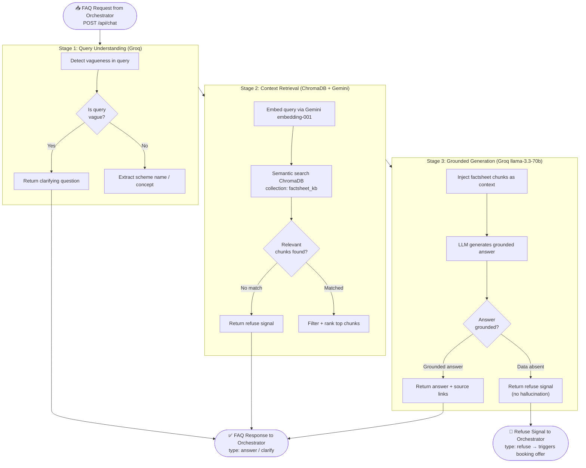
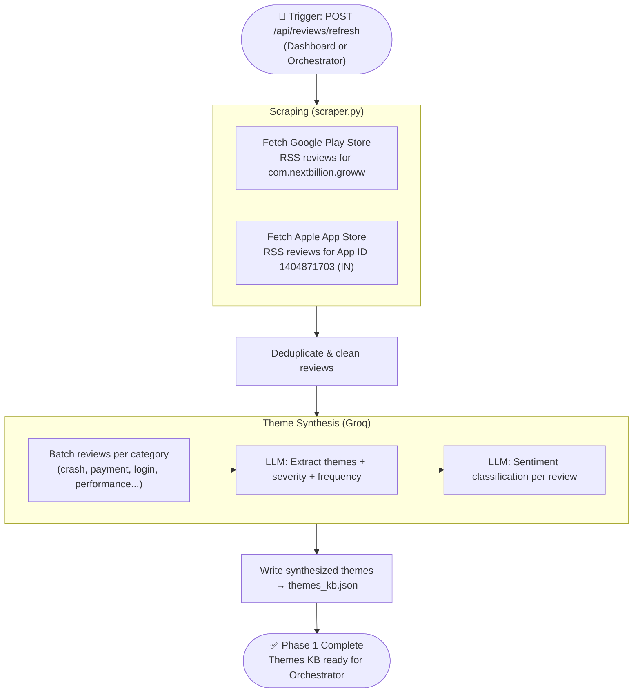
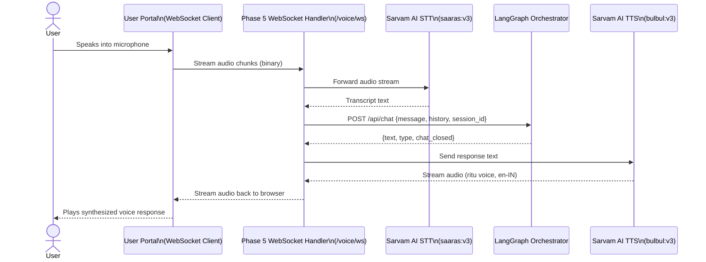

# Multi-Agent Interactions & Flowchart

This document details the multi-agent architecture, state transitions, and inter-service communications of the **Investor Ops & Intelligence Suite**.

The system operates as a **decoupled multi-service ecosystem** powered by a central **LangGraph Orchestrator (Phase 3)**, a **Review Intelligence Pipeline (Phase 1)**, a **Semantic Factsheet RAG Agent (Phase 2)**, a **Voice Streaming Agent (Phase 5)**, and a **Google Workspace Integration Layer**.

---

## High-Level System Architecture

---

## LangGraph Orchestrator: Agent State Machine

The **Orchestrator Agent** manages the conversational state using a structured **LangGraph StateGraph**. Every user message starts at `detect_intent` and flows through conditional edges depending on intent, active dialogue flags, and conversation history.

---

## Phase 2: Factsheet RAG Agent — Internal Pipeline

When `call_faq_agent_node` in the Orchestrator fires, it sends a request to Phase 2's `/api/chat` endpoint, which internally runs a **3-stage retrieval-augmented generation pipeline**.

---

## Phase 1: Review Intelligence Pipeline

Phase 1 runs as an **async background task** triggered via `POST /api/reviews/refresh`. The output (`themes_kb.json`) feeds directly into the Orchestrator's `check_theme_node`.

---

## Phase 5: Voice Agent Interaction

The Voice Agent wraps the same LangGraph turn logic in a **half-duplex WebSocket stream**. Each turn: audio in, text processing via Orchestrator, audio out.

---

## Cross-Service Interaction Map

Summary of every HTTP call crossing service boundaries:

| Caller | Direction | Target | Endpoint | Purpose |
| :--- | :---: | :--- | :--- | :--- |
| LangGraph (Phase 3) | → | Phase 1 (8000) | `GET /api/reviews/themes` | Load theme KB for intent routing |
| LangGraph (Phase 3) | → | Phase 1 (8000) | `GET /api/reviews/status` | Check scraping pipeline status |
| LangGraph (Phase 3) | → | Phase 1 (8000) | `POST /api/reviews/refresh` | Trigger review re-scrape |
| LangGraph (Phase 3) | → | Phase 2 (8001) | `POST /api/chat` | Run FAQ retrieval (call_faq_agent) |
| LangGraph (Phase 3) | → | Phase 2 (8001) | `GET /api/faqs/status` | Check indexing status |
| LangGraph (Phase 3) | → | Phase 2 (8001) | `POST /api/faqs/factsheets/refresh` | Trigger factsheet re-index |
| LangGraph (Phase 3) | → | Phase 2 (8001) | `POST /api/faqs/definitions/refresh` | Trigger definitions re-index |
| LangGraph (Phase 3) | → | Google Calendar | OAuth2 REST | Check slot availability / create event |
| LangGraph (Phase 3) | → | Google Docs | OAuth2 REST | Create meeting notes document |
| LangGraph (Phase 3) | → | Google Gmail | OAuth2 REST | Send booking confirmation email |
| Dashboard (Port 3000) | → | Phase 1 (8000) | `GET /api/reviews/themes` | Display Review Pulse page |
| Dashboard (Port 3000) | → | Phase 2 (8001) | `GET/POST /api/faqs/*` | Manage factsheet/definition URLs |
| Dashboard (Port 3000) | → | Phase 3 (8002) | `GET /api/system/status` | Auto-refresh readiness indicator |
| Dashboard (Port 3000) | → | Phase 3 (8002) | `GET /api/appointments` | Display booking log |
| User Portal (Port 5173) | → | Phase 3 (8002) | `POST /api/chat` | Chat turns |
| User Portal (Port 5173) | → | Phase 3 (8002) | `WS /voice/ws` | Voice streaming |

---

## Session State Persistence

The multi-agent network is stateless at the REST/WebSocket layer. Continuity across turns is maintained by serializing `OrchestratorState` on every message exchange.

| Session Variable | Type | Purpose |
| :--- | :--- | :--- |
| `last_intent` | `String` | Tracks the conversational track of the previous turn for interception logic |
| `current_scheme` | `String / Null` | Persists the mutual fund scheme under discussion for pronoun resolution |
| `current_concept` | `String / Null` | Persists the glossary term or concept in scope |
| `in_flight_booking` | `Dict` | Captures booking values: `{"topic": str, "date": str, "time": str}` |
| `active_path` | `String` | Tracks deep sub-states: `awaiting_confirmation`, `slot_available`, `slot_rejected` |
| `pending_booking_offer` | `Boolean` | If `true`, short affirmations route directly to the booking pipeline |
| `escalation_triggered` | `Boolean` | Bypasses FAQ logic and forces booking pipeline entry (resets each turn) |
| `faq_response` | `Dict / Null` | Holds the Phase 2 response for `generate_response_node` to consume |
| `booking_code` | `String / Null` | The 4-digit booking reference once generated |
| `chat_closed` | `Boolean` | Signals the frontend to disable input after a successful booking |
